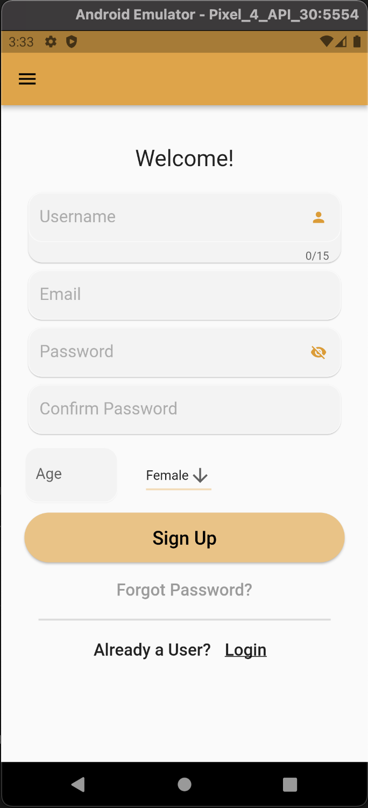
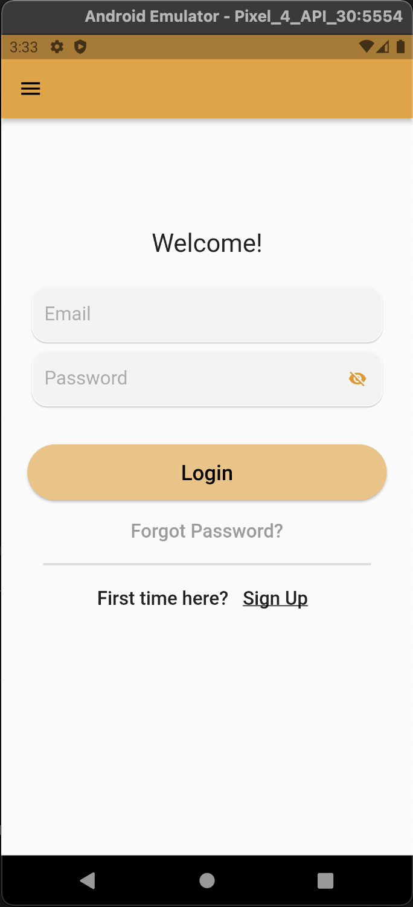
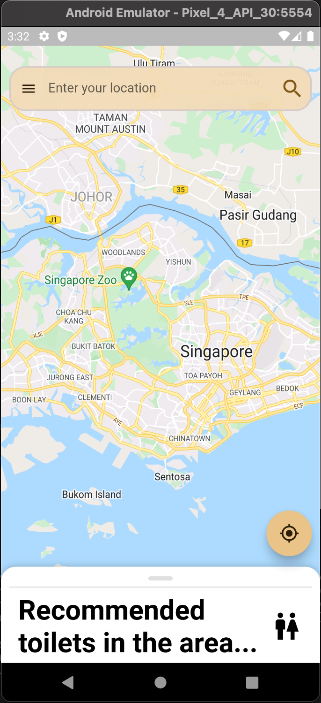
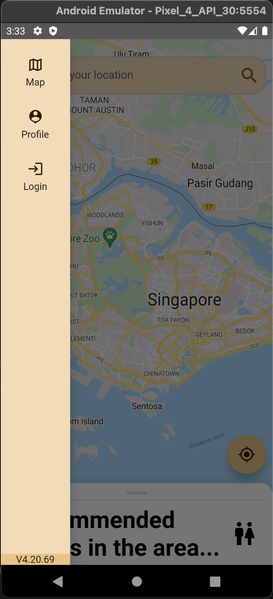
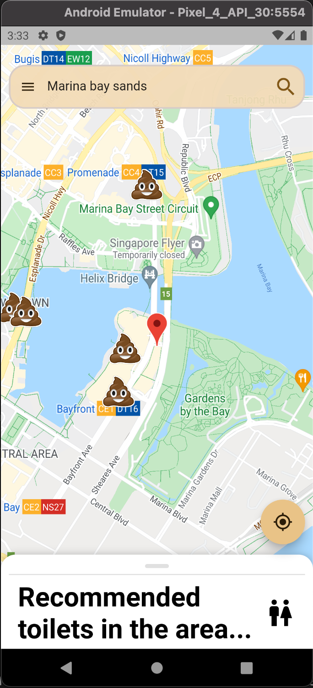
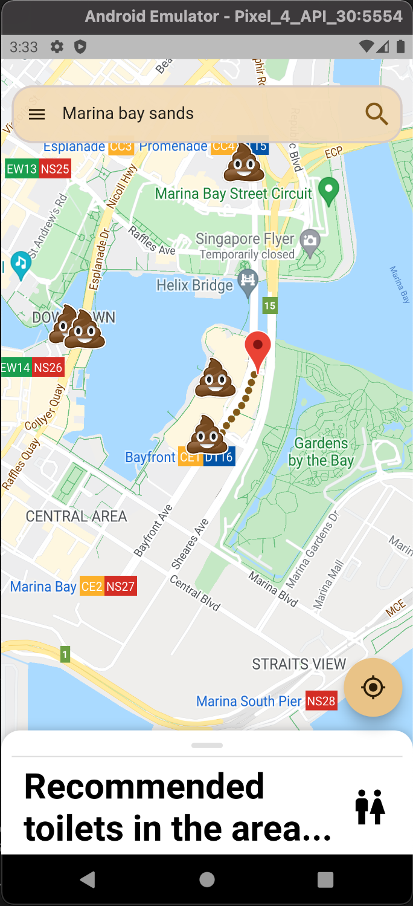
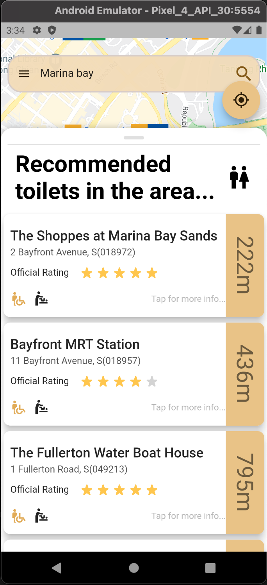
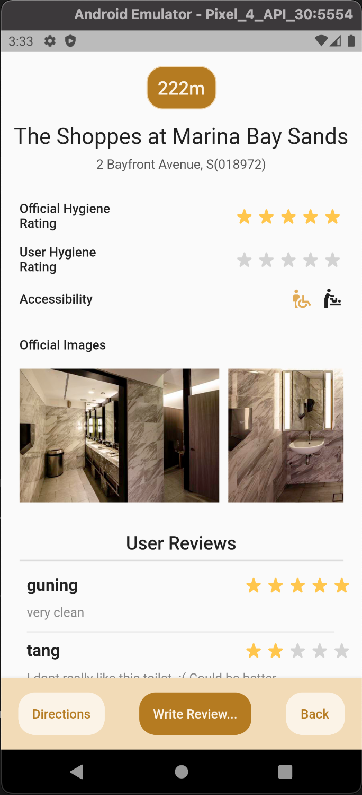
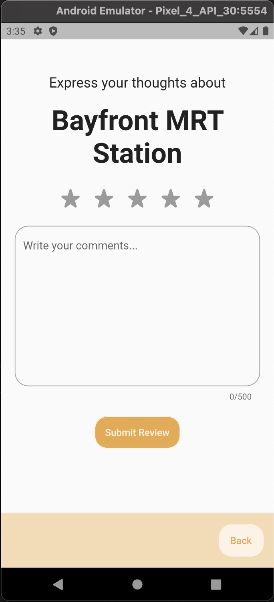

# CZ2006 Project - Toilocator

### App Description

Toilocator is a mobile app that provides a convenient way for the general public to search for the nearest public toilets from their current locations, as well as view toilet information and leave reviews of the toilets they have used.

Toilocator aims to improve the overall public toilet experience of the general Singapore population by searching the nearest public toilets from user location, displaying relevant toilet information and reviews of the toilet left by other users.

Here is a [youtube link](https://youtu.be/1Gx1KsMDHrw) that demonstrates the app.

### Source and tools

Data source - [toilet.org](https://www.toilet.org.sg/loomapdirectory)

Webscrape tool - [webscrape.io](https://webscraper.io)

### How to run the app

1. Checkout the main branch.
2. Navigate to the directory “toilocator”, then you can access the source code files.
3. Use Android Studio to set up an Android emulator.
4. Type `flutter run --no-sound-null-safety` in the terminal to run the app.

### API keys

- This project requires certain API keys from Google Maps and Firebase.
- There is currently no one file that stores all the required API keys, so if you were to run the code, you might need to search for the files that contains the API keys and insert your own.

## UI
##### Authentication Screen
  

##### Home Screen

 

##### On Search Location and Directions

 

##### On Swipe up Bottom Panel

 

##### Toilet Info and Reviews

 
